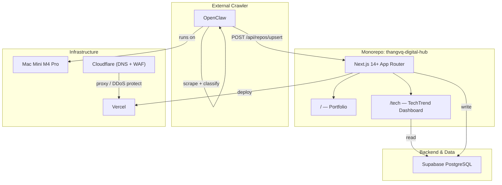
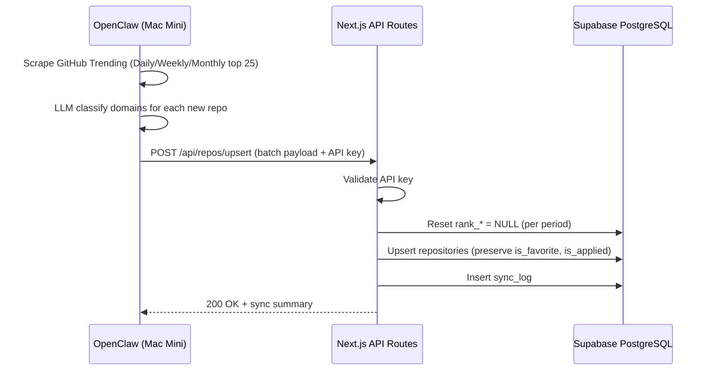

# 🏗️ ThangVQ Digital Hub — Detailed Implementation Plan

> **Domain:** `thangvq95.page`
> **Repo:** `thangvq-digital-hub` (monorepo)
> **Last Updated:** 2026-05-04

---

## 📐 Architecture Overview



### Tech Stack Decision

| Layer | Choice | Rationale |
|---|---|---|
| Framework | **Next.js 14+ (App Router)** | SSR/SSG for portfolio SEO, RSC for dashboard |
| Styling | **Tailwind CSS v4** + **ShadcnUI** | Rapid UI, consistent design system |
| Database | **Supabase (PostgreSQL)** | Free tier sufficient, realtime, built-in REST API |
| Crawler | **OpenClaw** (external) | Scrape + LLM classify + POST to upsert API |
| Hosting | **Vercel** | Edge deployment, native Next.js integration |
| DNS / Security | **Cloudflare** | DNS proxy, WAF, DDoS protection in front of Vercel |
| Domain | `thangvq95.page` | Already owned, managed via Cloudflare |

### Data Flow: OpenClaw → App → Supabase



> **Note:** OpenClaw is fully responsible for scraping and classifying repositories.
> The app only provides an API endpoint to receive pre-processed data and persist it to Supabase.

### Monorepo Structure

```
thangvq-digital-hub/
├── app/                        # Next.js App Router
│   ├── layout.tsx              # Root layout (fonts, metadata, theme)
│   ├── page.tsx                # Portfolio home page
│   ├── tech/
│   │   ├── page.tsx            # TechTrend Dashboard
│   │   └── loading.tsx         # Skeleton loader
│   ├── globals.css             # Tailwind + custom CSS
│   └── api/
│       ├── repos/
│       │   ├── route.ts        # GET: query repos | POST: upsert batch
│       │   └── [fullName]/
│       │       └── route.ts    # PATCH: toggle favorite/applied
│       └── sync/
│           └── route.ts        # GET: latest sync status
├── components/
│   ├── portfolio/              # Hero, About, TechStack, Experience, Contact
│   └── dashboard/              # RepoCard, DomainFilter, RankToggle, SearchBar
├── lib/
│   ├── supabase/
│   │   ├── client.ts           # Browser Supabase client
│   │   ├── server.ts           # Server Supabase client
│   │   └── types.ts            # Generated DB types
│   └── constants.ts            # Domain list, rank labels, etc.
├── public/
│   ├── images/                 # Profile photo, project screenshots
│   └── resume.pdf              # Downloadable CV
├── supabase/
│   └── migrations/             # SQL migration files
├── .gitignore                  # Git ignore rules
├── next.config.ts
├── tailwind.config.ts
├── package.json
├── .env.local                  # SUPABASE_URL, SUPABASE_ANON_KEY, SYNC_API_KEY
└── plan.md                     # This file
```

---

## 📑 Part 1: Professional Portfolio (`/`)

### 1.1 Design Direction

- **Style:** Dark-themed, minimalist, premium feel (glassmorphism accents)
- **Inspiration:** Linear.app, Vercel.com, Raycast.com
- **Typography:** `Inter` (body) + `JetBrains Mono` (code snippets)
- **Color Palette:**

| Token | Value | Usage |
|---|---|---|
| `--bg-primary` | `hsl(220, 20%, 6%)` | Page background |
| `--bg-card` | `hsl(220, 15%, 10%)` | Card surfaces |
| `--accent` | `hsl(210, 100%, 60%)` | Links, CTAs |
| `--accent-glow` | `hsl(210, 100%, 60%, 0.15)` | Glow effects |
| `--text-primary` | `hsl(0, 0%, 95%)` | Headings |
| `--text-secondary` | `hsl(0, 0%, 60%)` | Body text |

### 1.2 Sections & Content

> **Source:** LinkedIn [thangvq95](https://www.linkedin.com/in/thangvq95/) — detailed content to be filled in after CV is finalized.

#### A. Hero Section
- **Headline:** `Thang VQ` (large, animated gradient text)
- **Subtitle:** `Flutter Engineer · 10+ Years in Mobile`
- **Tagline:** "Building high-performance mobile experiences with Flutter & Android"
- **CTA Buttons:** `View Projects` | `Download CV`
- **Animation:** Subtle particle/grid background, fade-in on load

#### B. About Me
- Experienced Flutter and Android native app developer
- Hard-working, quick-learning, creative — always seeking challenging environments
- Flutter as primary focus: production apps shipped for multiple startups
- Infrastructure enthusiast: self-hosted Mac Mini M4 Pro production server
- Currently exploring Autonomous Software Engineering (ASE)

#### C. Tech Stack (Interactive Grid)

| Category | Technologies |
|---|---|
| **Mobile (Primary)** | Flutter, Dart, Riverpod, Bloc, Clean Architecture |
| **Mobile (Android)** | Kotlin, Jetpack Compose, Java, RxJava |
| **Backend & Infra** | Firebase, SQL, CI/CD, Docker, Cloudflare Tunnels |
| **Tools & APIs** | Android Studio, Figma, Google Maps API, Google Analytics |
| **Workflow** | Git, Design Patterns, AI-Assisted Dev (Claude, Gemini) |

- **UI:** Animated cards with icons, hover glow effect
- **Interaction:** Click to expand with detail/proficiency

#### D. Experience Timeline

| # | Period | Company | Role | Duration | Highlights |
|---|---|---|---|---|---|
| 1 | Dec 2020 — Present | **Care** | Flutter Engineer | ~5.5 years | Primary mobile engineer, CI/CD, Design Patterns |
| 2 | Jul 2019 — Nov 2020 | **Rovo** | Flutter Engineer | 1y 5m | Sports app, CI/CD, Design Patterns |
| 3 | Feb 2018 — Jun 2019 | **UpUp App** | Flutter Engineer | 1y 5m | Early Flutter adoption |
| 4 | Oct 2016 — Jan 2018 | **TMA Solutions** | Android Engineer | 1y 4m | Android native development |

> 📝 *Detailed descriptions will be added after the CV is finalized*

#### E. Education
- **Ton Duc Thang University** — Bachelor's degree, Computer Science (2013–2017)

#### F. Featured Projects
- Card grid (max 4-6 projects)
- Each card: Screenshot, title, description, tech tags, link
- Projects: Sổ Giáo Dân platform, Care app, Rovo app, and personal infra setup
- *Screenshots and details to be added*

#### G. Contact / Footer
- Email link, GitHub, LinkedIn
- "Built with Next.js · Hosted on Vercel" tagline

### 1.3 Implementation Tasks

| # | Task | Priority | Est. |
|---|---|---|---|
| P1 | Setup Next.js project + Tailwind + ShadcnUI | 🔴 High | 1h |
| P2 | Design system: colors, typography, spacing tokens | 🔴 High | 1h |
| P3 | Hero section with animations | 🔴 High | 2h |
| P4 | About Me section | 🟡 Med | 1h |
| P5 | Tech Stack interactive grid | 🟡 Med | 2h |
| P6 | Experience timeline | 🟡 Med | 2h |
| P7 | Featured Projects cards | 🟡 Med | 2h |
| P8 | Contact/Footer | 🟢 Low | 30m |
| P9 | SEO metadata, OG images | 🟡 Med | 1h |
| P10 | Responsive polish (mobile/tablet) | 🔴 High | 2h |
| P11 | Performance audit (Lighthouse 90+) | 🟢 Low | 1h |

---

## 🚀 Part 2: TechTrend Dashboard (`/tech`)

### 2.1 Database Schema

#### Table: `repositories`

```sql
CREATE TABLE repositories (
    -- Identity
    full_name       TEXT PRIMARY KEY,           -- "owner/repo"
    description     TEXT,
    html_url        TEXT NOT NULL,
    language        TEXT,                        -- Primary language
    avatar_url      TEXT,                        -- Owner avatar

    -- Rankings (nullable = not currently trending)
    rank_daily      SMALLINT CHECK (rank_daily BETWEEN 1 AND 25),
    rank_weekly     SMALLINT CHECK (rank_weekly BETWEEN 1 AND 25),
    rank_monthly    SMALLINT CHECK (rank_monthly BETWEEN 1 AND 25),

    -- Metrics
    stars_total     INTEGER DEFAULT 0,
    stars_growth    TEXT,                        -- "+1,200 stars this week"
    forks_total     INTEGER DEFAULT 0,

    -- AI Classification (assigned by OpenClaw)
    domains         TEXT[] DEFAULT '{}',         -- {"AI Agent", "Design", "Fintech"}

    -- User Interactions
    is_favorite     BOOLEAN DEFAULT FALSE,
    is_applied      BOOLEAN DEFAULT FALSE,
    notes           TEXT,                        -- Personal notes

    -- Timestamps
    first_seen_at   TIMESTAMPTZ DEFAULT NOW(),
    last_ranked_at  TIMESTAMPTZ,
    updated_at      TIMESTAMPTZ DEFAULT NOW()
);

-- Indexes
CREATE INDEX idx_repos_rank_daily ON repositories (rank_daily) WHERE rank_daily IS NOT NULL;
CREATE INDEX idx_repos_rank_weekly ON repositories (rank_weekly) WHERE rank_weekly IS NOT NULL;
CREATE INDEX idx_repos_rank_monthly ON repositories (rank_monthly) WHERE rank_monthly IS NOT NULL;
CREATE INDEX idx_repos_domains ON repositories USING GIN (domains);
CREATE INDEX idx_repos_favorite ON repositories (is_favorite) WHERE is_favorite = TRUE;

-- Auto-update timestamp
CREATE OR REPLACE FUNCTION update_updated_at()
RETURNS TRIGGER AS $$
BEGIN
    NEW.updated_at = NOW();
    RETURN NEW;
END;
$$ LANGUAGE plpgsql;

CREATE TRIGGER trigger_updated_at
    BEFORE UPDATE ON repositories
    FOR EACH ROW EXECUTE FUNCTION update_updated_at();
```

#### Table: `sync_logs` (Audit Trail)

```sql
CREATE TABLE sync_logs (
    id              UUID PRIMARY KEY DEFAULT gen_random_uuid(),
    sync_type       TEXT NOT NULL,              -- "daily", "weekly", "monthly", "full"
    repos_scraped   INTEGER DEFAULT 0,
    repos_new       INTEGER DEFAULT 0,
    repos_classified INTEGER DEFAULT 0,
    status          TEXT DEFAULT 'running',     -- "running", "success", "failed"
    error_message   TEXT,
    started_at      TIMESTAMPTZ DEFAULT NOW(),
    completed_at    TIMESTAMPTZ
);
```

#### Predefined Domains List

```typescript
export const DOMAINS = [
    "AI Agent", "AI/ML", "Frontend", "Backend", "Mobile",
    "DevOps", "Design", "Database", "Security", "Fintech",
    "Blockchain", "CLI Tool", "Game Dev", "Data Science",
    "Cloud Native", "IoT", "Education", "Productivity",
    "Media", "Testing", "Language/Runtime", "Framework"
] as const;
```

### 2.2 Dashboard UI Specifications

#### Layout

```
┌─────────────────────────────────────────────────┐
│ Header: "TechTrend" + Search Bar                │
├─────────────────────────────────────────────────┤
│ Filters:                                        │
│ [Daily | Weekly | Monthly]  [Domain ▼] [⭐ Fav] │
├─────────────────────────────────────────────────┤
│ Stats Bar: 150 repos · 12 favorites · 3 applied │
├─────────────────────────────────────────────────┤
│ ┌──────────┐ ┌──────────┐ ┌──────────┐         │
│ │ #1 Repo  │ │ #2 Repo  │ │ #3 Repo  │         │
│ │ ⭐ 45.2k │ │ ⭐ 32.1k │ │ ⭐ 28.7k │         │
│ │ +1.2k ↑  │ │ +890 ↑   │ │ +750 ↑   │         │
│ │ [AI][Dev] │ │ [Front]  │ │ [Mobile] │         │
│ │ ♥  ✓     │ │ ♥  ✓     │ │ ♥  ✓     │         │
│ └──────────┘ └──────────┘ └──────────┘         │
│ ... (responsive grid: 1-3 columns)              │
└─────────────────────────────────────────────────┘
```

#### Repo Card Components

- **Avatar:** Owner's GitHub avatar (32x32)
- **Title:** `owner/repo` (clickable → GitHub)
- **Description:** 2-line truncated
- **Rank Badge:** `#1` with gradient background
- **Stars:** Total + growth indicator
- **Language:** Color dot + name
- **Domain Tags:** Pill badges (max 3 visible, +N more)
- **Actions:** ♥ Favorite toggle | ✓ Applied toggle
- **Animation:** Card hover lift + border glow

### 2.3 API Routes

#### Read APIs (consumed by the dashboard frontend)

| Endpoint | Method | Description |
|---|---|---|
| `/api/repos` | GET | List repos with filters: `?period=daily&domain=AI&fav=true&q=search` |
| `/api/repos/[fullName]` | PATCH | Toggle `is_favorite`, `is_applied`, update `notes` |
| `/api/sync` | GET | Latest sync log entry |

#### Write API (called by OpenClaw to insert data)

| Endpoint | Method | Auth | Description |
|---|---|---|---|
| `/api/repos/upsert` | POST | `x-api-key` header | Receives batch payload from OpenClaw |

##### `POST /api/repos/upsert` — Request Payload

```typescript
interface UpsertPayload {
    sync_type: "daily" | "weekly" | "monthly" | "full";
    repositories: {
        full_name: string;          // "owner/repo"
        description: string;
        html_url: string;
        language?: string;
        avatar_url?: string;
        rank_daily?: number | null;
        rank_weekly?: number | null;
        rank_monthly?: number | null;
        stars_total?: number;
        stars_growth?: string;       // "+1,200 stars this week"
        forks_total?: number;
        domains: string[];           // ["AI Agent", "Backend"] — classified by OpenClaw
    }[];
}
```

##### API Logic

```
1. Validate x-api-key header
2. Create sync_log entry (status: "running")
3. Reset rank columns based on sync_type:
   - "daily"   → SET rank_daily = NULL
   - "weekly"  → SET rank_weekly = NULL
   - "monthly" → SET rank_monthly = NULL
   - "full"    → Reset all ranks
4. For each repo in payload:
   - UPSERT into repositories
   - On conflict (full_name): update ranks, stars, domains
   - PRESERVE: is_favorite, is_applied, notes, first_seen_at
5. Update sync_log (status: "success", counts)
6. Return summary response
```

### 2.4 Crawler Schedule (OpenClaw side)

| Job | Schedule | Action |
|---|---|---|
| Daily Sync | `0 8,20 * * *` (8AM, 8PM UTC+7) | Scrape daily trending top 25, classify, POST to API |
| Weekly Sync | `0 9 * * 1` (Monday 9AM) | Scrape weekly trending top 25 |
| Monthly Sync | `0 9 1 * *` (1st of month) | Scrape monthly trending top 25 |

### 2.5 Implementation Tasks

| # | Task | Priority | Est. |
|---|---|---|---|
| T1 | Supabase project setup + migration SQL | 🔴 High | 1h |
| T2 | Supabase client setup (`lib/supabase/`) | 🔴 High | 30m |
| T3 | API route: `GET /api/repos` with filters | 🔴 High | 2h |
| T4 | API route: `PATCH /api/repos/[fullName]` | 🔴 High | 1h |
| T5 | API route: `POST /api/repos/upsert` (for OpenClaw) | 🔴 High | 2h |
| T6 | API route: `GET /api/sync` | 🟢 Low | 30m |
| T7 | Dashboard page layout + rank toggle | 🔴 High | 2h |
| T8 | RepoCard component | 🔴 High | 2h |
| T9 | Domain filter (multi-select) | 🟡 Med | 1h |
| T10 | Search bar (debounced) | 🟡 Med | 1h |
| T11 | Favorite/Applied toggle (optimistic UI) | 🟡 Med | 1h |
| T12 | Stats bar | 🟢 Low | 30m |
| T13 | Loading skeleton | 🟢 Low | 30m |

---

## 🚀 Phased Rollout

### Phase 1: Foundation (Day 1-2)
- [x] Repo structure + plan ✅
- [ ] Next.js + Tailwind + ShadcnUI setup (P1)
- [ ] Design system tokens (P2)
- [ ] Supabase project + migrations (T1, T2)

### Phase 2: Portfolio (Day 3-4)
- [ ] Hero + About (P3, P4)
- [ ] Tech Stack + Experience (P5, P6)
- [ ] Projects + Footer (P7, P8)
- [ ] SEO + responsive (P9, P10)

### Phase 3: Dashboard API (Day 5-6)
- [ ] Read APIs (T3, T4, T6)
- [ ] Upsert API for OpenClaw (T5)
- [ ] Test with sample data

### Phase 4: Dashboard UI (Day 7-8)
- [ ] Dashboard layout + RepoCard (T7, T8)
- [ ] Filters + search (T9, T10, T11)
- [ ] Stats bar + skeleton (T12, T13)

### Phase 5: Deploy & Integrate (Day 9-10)
- [ ] Performance audit (P11)
- [ ] Deploy to Vercel
- [ ] Cloudflare DNS: add `thangvq95.page` CNAME → Vercel (proxy enabled = orange cloud ☁️)
- [ ] Vercel: add custom domain `thangvq95.page`, verify SSL
- [ ] Cloudflare WAF: enable security rules, bot fight mode
- [ ] Configure OpenClaw to call upsert API
- [ ] Final QA

---

## 🔐 Environment Variables

```env
# Supabase
NEXT_PUBLIC_SUPABASE_URL=https://xxx.supabase.co
NEXT_PUBLIC_SUPABASE_ANON_KEY=eyJ...
SUPABASE_SERVICE_ROLE_KEY=eyJ...    # Server-side only, for upsert

# OpenClaw Sync Protection
SYNC_API_KEY=random-secret-key       # x-api-key header for /api/repos/upsert

# Analytics (optional)
NEXT_PUBLIC_GA_ID=G-XXXXXXX
```

---

## 📝 Notes & Decisions

1. **Monorepo vs Multi-repo:** Single Next.js app — portfolio and dashboard share layout, fonts, and theme
2. **SSR vs SSG:** Portfolio pages use SSG (static), Dashboard uses SSR + client-side fetching
3. **Supabase vs Self-hosted PG:** Supabase for convenience — free tier is sufficient for a side project, REST API included out of the box
4. **OpenClaw integration:** OpenClaw handles all scraping and LLM classification externally; the app only receives pre-processed data via the upsert API. No LLM key is needed in the app.
5. **RLS Policy:** Row Level Security enabled — anon key is read-only, service role key is used by the upsert API
6. **Hosting:** Vercel — native Next.js integration, fast deploys, preview deployments
7. **DNS / Security:** Cloudflare sits in front of Vercel as DNS proxy + WAF. Traffic flow: `User → Cloudflare (DNS proxy + DDoS/WAF) → Vercel (origin)`. Cloudflare issues the edge SSL certificate; Vercel issues a separate origin certificate.
8. **Portfolio content:** Temporarily sourced from LinkedIn; detailed content will be updated once the CV is finalized
