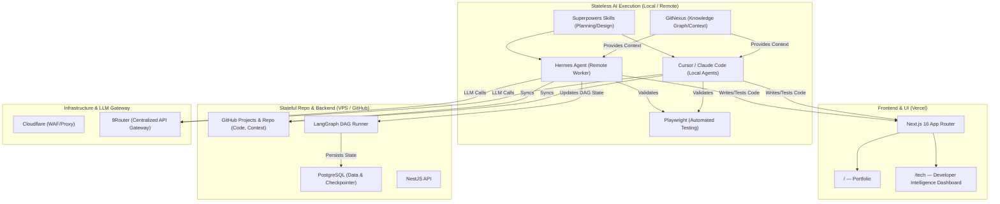
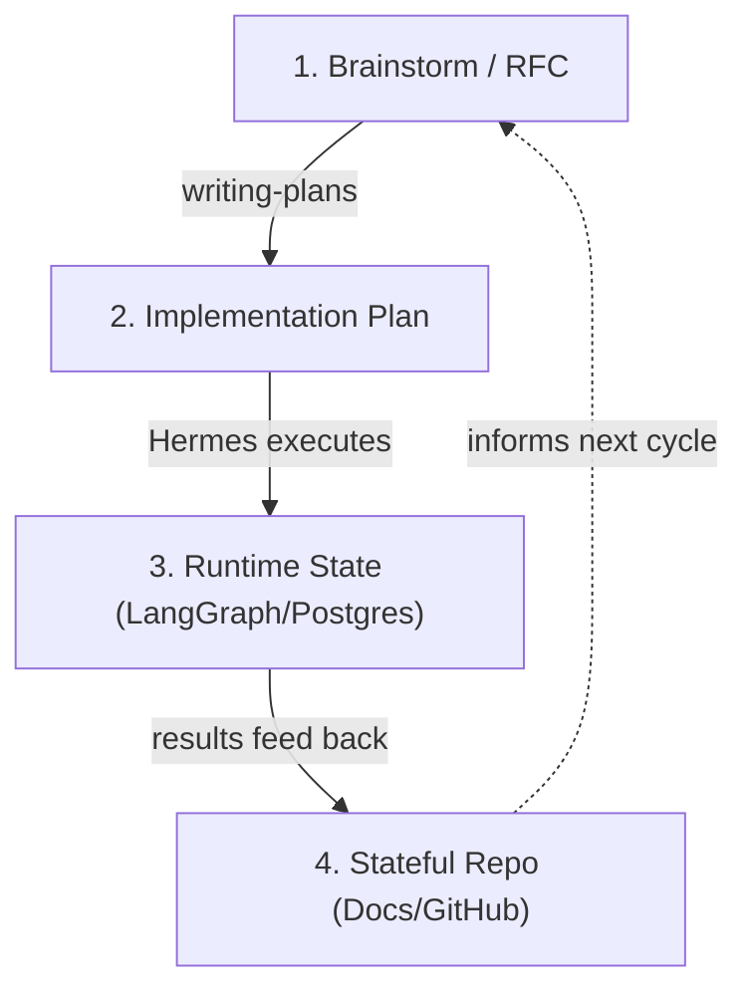

# ThangVQ Digital Hub — PRD

> **Domain:** `thangvq95.page`
> **Repo:** `thangvq-digital-hub` (monorepo)
> **Developed by:** Hermes Agent (Powered by Superpowers Skills & GitNexus)
> **Status:** Autonomous Workflow Ready
> **Last Updated:** 2026-05-07

---

## Architecture Overview



### Tech Stack

| Layer | Choice | Rationale |
|---|---|---|
| Frontend | **Next.js 16 (Vercel)** | SSR/SSG for Portfolio SEO, RSC for Dashboard |
| Styling | **Tailwind CSS v4 + ShadcnUI** | Rapid UI, consistent design system |
| Backend API | **NestJS (Docker on VPS)** | Centralized on VPS for Hermes/frontend access |
| Database | **PostgreSQL (Docker on VPS)** | Business data, runtime state, LangGraph Checkpointer |
| AI Orchestration | **Hermes + LangGraph + GitNexus** | DAG automation, execution, state tracking |
| Testing | **Playwright** | E2E & API automation |
| Project Management | **GitHub Repo & Projects** | Single Source of Truth (Code, Context, Kanban) |
| LLM Gateway | **9Router** | Centralized API gateway (`https://9router.phieucaphe.com/v1`). No local LLMs on VPS. |
| DNS / Security | **Cloudflare** | DNS proxy, WAF, DDoS protection |
| Domain | `thangvq95.page` | Managed via Cloudflare |

---

## Routes

```
/                       → Portfolio (SSG)
/tech                   → Redirect to /tech/trending
/tech/trending          → GitHub Trending repos (daily/weekly/monthly rankings)
/tech/releases          → Cross-repo release feed (favorites only, AI-analyzed)
/tech/favorites         → Favorited repos
/tech/[repo]            → Repo detail + release history + AI summaries + notes
```

---

## Part 1: Portfolio (`/`)

Design direction, personal content, and implementation details are in:
→ [`docs/portfolio-content.md`](portfolio-content.md)

### Implementation Tasks

| # | Task | Priority |
|---|---|---|
| P1 | Next.js + Tailwind + ShadcnUI setup | 🔴 High |
| P2 | Design system tokens (colors, typography, spacing) | 🔴 High |
| P3 | Hero section with animations | 🔴 High |
| P4 | About Me section | 🟡 Med |
| P5 | Tech Stack interactive grid | 🟡 Med |
| P6 | Experience timeline | 🟡 Med |
| P7 | Featured Projects cards | 🟡 Med |
| P8 | Contact/Footer | 🟢 Low |
| P9 | SEO metadata, OG images | 🟡 Med |
| P10 | Responsive polish (mobile/tablet) | 🔴 High |
| P11 | Performance audit (Lighthouse 90+) | 🟢 Low |

---

## Part 2: Developer Intelligence Dashboard (`/tech`)

### Core Features

1. **Trending Repos** — Daily/weekly/monthly GitHub Trending, AI-classified by domain
2. **Unviewed Highlighting** — New repos highlighted until user clicks into detail view
3. **Favorite Release Monitoring** — Daily check for new releases on favorited repos
4. **AI Release Analysis** — Hermes generates summaries, breaking changes, migration notes, relevance scores
5. **Release Feed** — Cross-repo timeline for quick daily scanning
6. **Repo Detail Page** — Deep-dive with trend history, releases, AI summaries, personal notes

### Database Schema

Detailed schemas in architecture docs. Summary:

| Table | Purpose |
|---|---|
| `repositories` | Repo identity, rankings, metrics, domains, user interactions, view state |
| `repo_releases` | Release data + AI analysis (summary, breaking changes, migration notes, relevance score) |
| `sync_logs` | Audit trail for sync operations |

Key constraints:
- `repo_releases` has `UNIQUE(repo_full_name, release_tag)` for idempotent upserts
- `release_body_hash` detects edited release notes for re-analysis
- `is_viewed` on both repos and releases (different consumption signals)
- `last_release_checked_at` on repos for cron observability

### Cronjob Pipelines

| Cronjob | Target | Schedule | Details |
|---|---|---|---|
| Trending Sync | All repos | 2x daily + weekly + monthly | → [repo-sync-lifecycle.md](architecture/repo-sync-lifecycle.md) |
| Favorite Release Monitor | `is_favorite = true` only | Daily 10AM | → [release-analysis-pipeline.md](architecture/release-analysis-pipeline.md) |

### API Routes

| Endpoint | Method | Auth | Description |
|---|---|---|---|
| `/api/repos` | GET | — | List repos with filters |
| `/api/repos/[fullName]` | GET | — | Repo detail with releases |
| `/api/repos/[fullName]` | PATCH | — | Toggle favorite/applied/viewed, update notes |
| `/api/repos/upsert` | POST | `x-api-key` | Batch upsert from Hermes trending sync |
| `/api/releases` | GET | — | Release feed (favorites, paginated) |
| `/api/releases/upsert` | POST | `x-api-key` | Insert AI-analyzed releases from Hermes |
| `/api/sync` | GET | — | Latest sync log |

---

## Phase 2: Hybrid Autonomous Development

### Stateless AI & Stateful Repo Architecture

The system enforces a strict separation between execution (Stateless) and memory/state (Stateful):

1. **Stateless AI:** All agents (Hermes, Cursor, Claude Code) operate statelessly. They rely entirely on externalized memory to maintain context.
2. **Stateful Repo & DB:** 
   - **GitHub Repo:** Stores the single source of truth (`CONTEXT.md`, `PRD.md`, `docs/architecture/`, Codebase).
   - **PostgreSQL:** Persists runtime execution state (Task DAGs) and acts as the **LangGraph Checkpointer**.
3. **Hybrid Development:** Hermes operates as a "Remote Agent" on the VPS, running heavy DAG automated tasks and cronjobs. Meanwhile, developers can clone the repo locally and use Cursor or Claude Code. Both local and remote agents share the same GitNexus knowledge graph and documentation, ensuring seamless interoperability and consistent architectural alignment.

### Information Layers



| Layer | Purpose | Location |
|---|---|---|
| **1. Brainstorm / RFC** | Design discussions, architecture reasoning | `docs/superpowers/specs/*` |
| **2. Implementation Plan** | Task breakdown, execution order, dependencies | Generated by `writing-plans` skill |
| **3. Runtime State** | Execution state, Task DAG tracking, persistent memory | PostgreSQL (LangGraph Checkpointer) + GitHub Projects |
| **4. Documentation** | Human-facing architecture, core truth | GitHub (`docs/PRD.md`, `docs/architecture/*`) |

### Execution Pipeline

```
Brainstorm (brainstorming skill) → Plan (writing-plans skill) → Hermes executes → GitHub Projects tracking → docs update
```

1. **Brainstorm** — Human + AI discuss design using `brainstorming` skill → RFC in `docs/superpowers/specs/`
2. **Plan** — `writing-plans` skill generates implementation plan with task breakdown and dependencies
3. **Execute** — Hermes picks up tasks, uses GitNexus for context, Playwright for TDD, self-heals on failure
4. **Track** — Task status synced to GitHub Projects (To-do / In Progress / Done)
5. **Document** — Update architecture docs and close issues after completion

### Task Execution Model

Phase-based grouping (human clarity) + dependency DAG (machine optimization).
Full specification: → [task-execution-model.md](architecture/task-execution-model.md)

### Bug Fix Flow (Sentry-triggered)

```
Sentry Alert → GitHub Issue (auto-created) → Hermes picks up →
GitNexus locates code → Fix + Playwright test → PR → Close Issue
```

### System Roles

| Component | Role |
|---|---|
| **Hermes Agent** | Remote Developer / Autonomous Worker — executes cronjobs, heavy tasks, and LangGraph DAG flows directly on the VPS. |
| **Local Agents** | Cursor / Claude Code — stateless local development interfaces sharing the same knowledge context. |
| **LangGraph** | DAG orchestrator managing task states persistently via PostgreSQL Checkpointer. |
| **GitNexus** | Knowledge graph — provides unified codebase context to all agents via MCP. |
| **Playwright** | Testing — E2E & API automation. |
| **GitHub Projects** | Human-readable visualization of the current runtime task state. |
| **9Router** | Centralized LLM API Gateway. **No local LLMs are installed on the VPS.** |

---

## Agent Operating Rules

1. **Single Source of Truth** — PRD + architecture docs define the system. Brainstorm RFCs are reference/history only.
2. **Skill Routing** — Use Superpowers skills (`brainstorming`, `writing-plans`) for Planning/Design. Use Matt Pocock skills (`tdd`, `diagnose`) for execution, debugging, and testing.
3. **No Manual Sync** — Hermes syncs task state between specs and GitHub Projects
4. **Test First** — Playwright tests must pass before a task is marked DONE
5. **Knowledge Persistence** — Update project dictionary after each feature for future planning context

---

## Environment & Infrastructure

- **VPS (Remote Execution):** Runs Dockerized Backend (NestJS), Database (PostgreSQL), Hermes Agent, and LangGraph DAG runner.
- **Frontend Hosting:** Vercel edge deployment.
- **Security & Network:** Cloudflare WAF + 9Router Proxy.
- **LLM Gateway:** 9Router is the exclusive LLM provider. No local LLM instances are maintained on the VPS.

### Environment Variables

```env
NEXT_PUBLIC_API_URL=https://api.thangvq95.page
SYNC_API_KEY=<secret>                    # x-api-key for Hermes upsert APIs
NEXT_PUBLIC_GA_ID=G-XXXXXXX              # Analytics (optional)
```

---

## Notes & Decisions

1. **Monorepo** — Portfolio and dashboard share layout, fonts, theme in one Next.js app
2. **SSR vs SSG** — Portfolio uses SSG (static), Dashboard uses SSR + client-side fetching
3. **Backend** — Self-hosted NestJS + PostgreSQL via Docker for direct Hermes access
4. **Hermes integration** — Handles scraping, AI classification, and release analysis externally; NestJS receives pre-processed data
5. **Hosting** — Vercel for frontend edge deployment; DigitalOcean/Mac Mini for backend
6. **DNS** — Cloudflare proxy + WAF in front of Vercel. Traffic: `User → Cloudflare → Vercel`
7. **Document structure** — PRD stays concise; deep mechanics in `docs/architecture/`; personal content in `docs/portfolio-content.md`
8. **Autonomous Pipeline** — Superpowers skills (brainstorming → writing-plans) + GitNexus + Hermes + Playwright form the development cycle. Spec Kit concepts (DAGs, structured contracts) to be adopted incrementally as complexity grows.

---

## Related Documents

| Document | Purpose |
|---|---|
| [portfolio-content.md](portfolio-content.md) | Personal profile, experience, projects |
| [architecture/task-execution-model.md](architecture/task-execution-model.md) | Phase + DAG execution, state machine, task metadata |
| [architecture/release-analysis-pipeline.md](architecture/release-analysis-pipeline.md) | Favorite monitoring, AI analysis, relevance scoring |
| [architecture/repo-sync-lifecycle.md](architecture/repo-sync-lifecycle.md) | Trending sync flow, upsert logic, data preservation |
