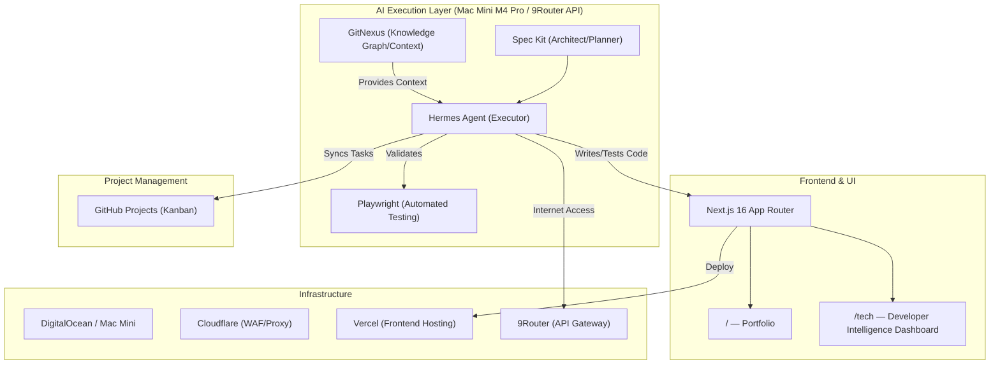
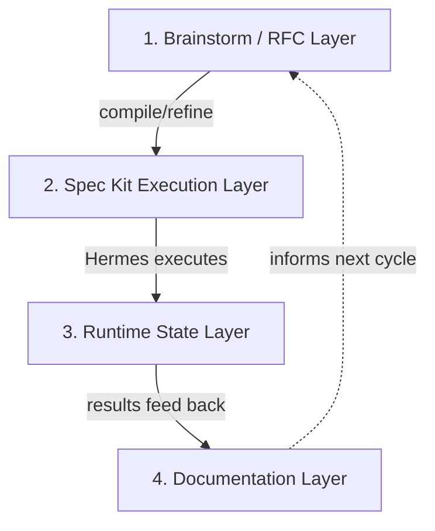

# ThangVQ Digital Hub — PRD

> **Domain:** `thangvq95.page`
> **Repo:** `thangvq-digital-hub` (monorepo)
> **Developed by:** Hermes Agent (Powered by Spec Kit & GitNexus)
> **Status:** Autonomous Workflow Ready
> **Last Updated:** 2026-05-07

---

## Architecture Overview



### Tech Stack

| Layer | Choice | Rationale |
|---|---|---|
| Frontend | **Next.js 16 (Vercel)** | SSR/SSG for Portfolio SEO, RSC for Dashboard |
| Styling | **Tailwind CSS v4 + ShadcnUI** | Rapid UI, consistent design system |
| Backend API | **NestJS (Docker/VPS)** | Centralized on VPS for direct Hermes access |
| Database | **PostgreSQL (Docker/VPS)** | Repository data, releases, sync logs |
| AI Orchestration | **Spec Kit + Hermes + GitNexus** | Planning, execution, context |
| Testing | **Playwright** | E2E & API automation |
| Project Management | **GitHub Projects** | Kanban (To-do / In Progress / Done) |
| Hosting | **Vercel** | Edge deployment, native Next.js integration |
| DNS / Security | **Cloudflare** | DNS proxy, WAF, DDoS protection |
| Network | **9Router** | API Gateway: `https://9router.phieucaphe.com/v1` |
| Domain | `thangvq95.page` | Managed via Cloudflare |

---

## Routes

```
/                       → Portfolio (SSG)
/tech                   → Redirect to /tech/trending
/tech/trending          → GitHub Trending repos (daily/weekly/monthly rankings)
/tech/releases          → Cross-repo release feed (favorites only, AI-analyzed)
/tech/favorites         → Favorited repos
/tech/[repo]            → Repo detail + release history + AI summaries + notes
```

---

## Part 1: Portfolio (`/`)

Design direction, personal content, and implementation details are in:
→ [`docs/portfolio-content.md`](portfolio-content.md)

### Implementation Tasks

| # | Task | Priority |
|---|---|---|
| P1 | Next.js + Tailwind + ShadcnUI setup | 🔴 High |
| P2 | Design system tokens (colors, typography, spacing) | 🔴 High |
| P3 | Hero section with animations | 🔴 High |
| P4 | About Me section | 🟡 Med |
| P5 | Tech Stack interactive grid | 🟡 Med |
| P6 | Experience timeline | 🟡 Med |
| P7 | Featured Projects cards | 🟡 Med |
| P8 | Contact/Footer | 🟢 Low |
| P9 | SEO metadata, OG images | 🟡 Med |
| P10 | Responsive polish (mobile/tablet) | 🔴 High |
| P11 | Performance audit (Lighthouse 90+) | 🟢 Low |

---

## Part 2: Developer Intelligence Dashboard (`/tech`)

### Core Features

1. **Trending Repos** — Daily/weekly/monthly GitHub Trending, AI-classified by domain
2. **Unviewed Highlighting** — New repos highlighted until user clicks into detail view
3. **Favorite Release Monitoring** — Daily check for new releases on favorited repos
4. **AI Release Analysis** — Hermes generates summaries, breaking changes, migration notes, relevance scores
5. **Release Feed** — Cross-repo timeline for quick daily scanning
6. **Repo Detail Page** — Deep-dive with trend history, releases, AI summaries, personal notes

### Database Schema

Detailed schemas in architecture docs. Summary:

| Table | Purpose |
|---|---|
| `repositories` | Repo identity, rankings, metrics, domains, user interactions, view state |
| `repo_releases` | Release data + AI analysis (summary, breaking changes, migration notes, relevance score) |
| `sync_logs` | Audit trail for sync operations |

Key constraints:
- `repo_releases` has `UNIQUE(repo_full_name, release_tag)` for idempotent upserts
- `release_body_hash` detects edited release notes for re-analysis
- `is_viewed` on both repos and releases (different consumption signals)
- `last_release_checked_at` on repos for cron observability

### Cronjob Pipelines

| Cronjob | Target | Schedule | Details |
|---|---|---|---|
| Trending Sync | All repos | 2x daily + weekly + monthly | → [repo-sync-lifecycle.md](architecture/repo-sync-lifecycle.md) |
| Favorite Release Monitor | `is_favorite = true` only | Daily 10AM | → [release-analysis-pipeline.md](architecture/release-analysis-pipeline.md) |

### API Routes

| Endpoint | Method | Auth | Description |
|---|---|---|---|
| `/api/repos` | GET | — | List repos with filters |
| `/api/repos/[fullName]` | GET | — | Repo detail with releases |
| `/api/repos/[fullName]` | PATCH | — | Toggle favorite/applied/viewed, update notes |
| `/api/repos/upsert` | POST | `x-api-key` | Batch upsert from Hermes trending sync |
| `/api/releases` | GET | — | Release feed (favorites, paginated) |
| `/api/releases/upsert` | POST | `x-api-key` | Insert AI-analyzed releases from Hermes |
| `/api/sync` | GET | — | Latest sync log |

---

## Autonomous Workflow

### Information Layers

The system enforces a strict separation of concerns across 4 layers:



| Layer | Purpose | Location | Consumed By |
|---|---|---|---|
| **1. Brainstorm / RFC** | Design discussions, architecture reasoning, decision history | `docs/superpowers/specs/*` | Humans, Spec Kit (reference only) |
| **2. Spec Kit Contracts** | Machine-readable structured specs, tasks, contracts — **canonical source of truth** | Managed by Spec Kit | Hermes (execution) |
| **3. Runtime State** | Execution state, retries, logs, checkpoints, task status | Runtime / GitHub Projects | Hermes (operational) |
| **4. Documentation** | Human-facing docs, onboarding, architecture reference | `docs/PRD.md`, `docs/architecture/*` | Humans, agents (context) |

> **Key rule:** Markdown brainstorm docs (`docs/superpowers/specs/*`) are reference knowledge only, not execution contracts. Hermes executes exclusively from Spec Kit structured output.

### Execution Pipeline

```
Brainstorm RFC → compile into Spec Kit contracts → Hermes executes → runtime state tracking → docs update
```

1. **Brainstorm** — Human + AI discuss design in `docs/superpowers/specs/`. RFC-style, not executable.
2. **Compile** — Spec Kit refines brainstorm output into structured, machine-readable contracts (specs, tasks, dependencies).
3. **Execute** — Hermes executes from Spec Kit contracts using Phase+DAG model with Playwright TDD and self-healing.
4. **Track** — Runtime state (task status, retries, logs) lives in GitHub Projects + operational storage.
5. **Document** — After completion, update human-facing docs and close issues.

### Task Execution Model

Phase-based grouping (human clarity) + dependency DAG (machine optimization).
Full specification: → [task-execution-model.md](architecture/task-execution-model.md)

### Bug Fix Flow (Sentry-triggered)

```
Sentry Alert → GitHub Issue (auto-created) → Hermes picks up →
GitNexus locates code → Fix + Playwright test → PR → Close Issue
```

### System Roles

| Component | Role |
|---|---|
| **Spec Kit** | Architect/Planner — compiles brainstorms into executable contracts |
| **GitNexus** | Knowledge graph — provides codebase context via MCP |
| **Hermes Agent** | Executor — runs Spec Kit contracts, writes code, tests, self-heals |
| **Playwright** | Testing — E2E & API automation, headless on Mac Mini |
| **GitHub Projects** | Runtime state — task status tracking synced from Hermes |
| **9Router** | API Gateway — stable internet access for agents |

---

## Agent Operating Rules

1. **Single Source of Truth** — Spec Kit contracts are the only execution authority. Brainstorm docs are reference only.
2. **No Manual Sync** — Hermes syncs task state between specs and GitHub Projects
3. **Test First** — Playwright tests must pass before a task is marked DONE
4. **Knowledge Persistence** — Update project dictionary after each feature for future planning context

---

## Environment & Infrastructure

- **Workstation:** Mac Mini M4 Pro (16GB RAM) — runs local LLMs & agents
- **Deployment:** Vercel (frontend), DigitalOcean or Mac Mini (backend via Docker)
- **Security:** Cloudflare WAF + 9Router Proxy

### Environment Variables

```env
NEXT_PUBLIC_API_URL=https://api.thangvq95.page
SYNC_API_KEY=<secret>                    # x-api-key for Hermes upsert APIs
NEXT_PUBLIC_GA_ID=G-XXXXXXX              # Analytics (optional)
```

---

## Notes & Decisions

1. **Monorepo** — Portfolio and dashboard share layout, fonts, theme in one Next.js app
2. **SSR vs SSG** — Portfolio uses SSG (static), Dashboard uses SSR + client-side fetching
3. **Backend** — Self-hosted NestJS + PostgreSQL via Docker for direct Hermes access
4. **Hermes integration** — Handles scraping, AI classification, and release analysis externally; NestJS receives pre-processed data
5. **Hosting** — Vercel for frontend edge deployment; DigitalOcean/Mac Mini for backend
6. **DNS** — Cloudflare proxy + WAF in front of Vercel. Traffic: `User → Cloudflare → Vercel`
7. **Document structure** — PRD stays concise; deep mechanics in `docs/architecture/`; personal content in `docs/portfolio-content.md`
8. **Autonomous Pipeline** — Spec Kit + GitNexus + Hermes + Playwright form a closed-loop development cycle

---

## Related Documents

| Document | Purpose |
|---|---|
| [portfolio-content.md](portfolio-content.md) | Personal profile, experience, projects |
| [architecture/task-execution-model.md](architecture/task-execution-model.md) | Phase + DAG execution, state machine, task metadata |
| [architecture/release-analysis-pipeline.md](architecture/release-analysis-pipeline.md) | Favorite monitoring, AI analysis, relevance scoring |
| [architecture/repo-sync-lifecycle.md](architecture/repo-sync-lifecycle.md) | Trending sync flow, upsert logic, data preservation |
