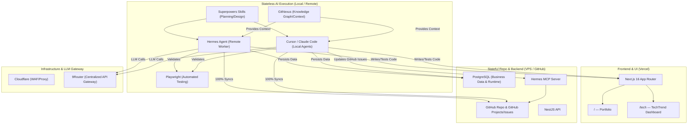
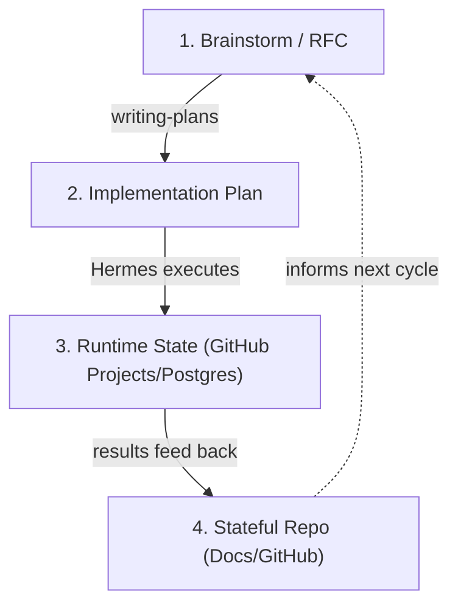

# ThangVQ Digital Hub — PRD

> **Domain:** `thangvq95.page`
> **Repo:** `thangvq-digital-hub` (monorepo)
> **Developed by:** Hermes Agent (Powered by Superpowers Skills & GitNexus)
> **Status:** Autonomous Workflow Ready
> **Last Updated:** 2026-05-11

---

## Architecture Overview



### Tech Stack

| Layer | Choice | Rationale |
|---|---|---|
| Frontend | **Next.js 16 (Vercel)** | SSR/SSG for Portfolio SEO, RSC for Dashboard |
| Styling | **Tailwind CSS v4 + ShadcnUI** | Rapid UI, consistent design system |
| Backend API | **NestJS (Docker on VPS)** | Centralized on VPS for Hermes/frontend access |
| Database | **PostgreSQL (Docker on VPS)** | Business data, runtime state |
| AI Orchestration | **Hermes + GitNexus** | Autonomous execution, native DAG state tracking |
| Testing | **Playwright** | E2E & API automation |
| Project Management | **GitHub Projects/Issues** | Single Source of Truth for Task/DAG state  |
| LLM Gateway | **9Router** | Centralized API gateway (`https://9router.phieucaphe.com/v1`). No local LLMs on VPS. |
| DNS / Security | **Cloudflare** | DNS proxy, WAF, DDoS protection |
| Domain | `thangvq95.page` | Managed via Cloudflare |

---

## Routes

```
/                       → Portfolio (SSG)
/tech                   → TechTrend Dashboard (trending repos, load more)
/tech/[owner]/[repo]    → Repo detail + AI Magic Analyze
```

---

## Part 1: Portfolio (`/`)

Design direction, personal content, and implementation details are in:
→ [`docs/portfolio-content.md`](portfolio-content.md)

### Implementation Tasks

| # | Task | Priority |
|---|---|---|
| P1 | Next.js + Tailwind + ShadcnUI setup | 🔴 High |
| P2 | Design system tokens (colors, typography, spacing) | 🔴 High |
| P3 | Hero section with animations | 🔴 High |
| P4 | About Me section | 🟡 Med |
| P5 | Tech Stack interactive grid | 🟡 Med |
| P6 | Experience timeline | 🟡 Med |
| P7 | Featured Projects cards | 🟡 Med |
| P8 | Contact/Footer | 🟢 Low |
| P9 | SEO metadata, OG images | 🟡 Med |
| P10 | Responsive polish (mobile/tablet) | 🔴 High |
| P11 | Performance audit (Lighthouse 90+) | 🟢 Low |

---

## Part 2: TechTrend Dashboard (`/tech`)

### Core Features

1. **Weekly Trending Sync** — Hermes scrapes `github.com/trending?since=weekly` (first page, ~25 repos) at 8AM & 8PM daily
2. **Simple Dedup** — If repo already exists in DB, skip. If new, insert with original trending order.
3. **Favorite** — Mark repos as favorites, filter by favorites tab
4. **Archive** — Hide repos you're not interested in, viewable in archived tab
5. **Add Repo (Manual)** — Add any GitHub repository via URL manually via the UI.
6. **New Repo Indicator (`is_read`)** — Newly scraped repositories have a "NEW" badge. Clicking into the repo detail page automatically marks them as read.
7. **AI Magic Analyze** — On repo detail page, click "Magic" button → AI reads the repo and generates a **Markdown-formatted** explanation
8. **Favorite Release Monitor** — Daily cronjob checks favorite repos for new GitHub releases, highlights them with `has_new_release` badge
9. **Release Changelog Link** — Detail page links to GitHub Releases page; clicking it dismisses the new-release highlight
10. **Load More Pagination** — 20 repos per batch, load more on scroll/click

### Database Schema

| Table | Purpose |
|---|---|
| `repositories` | Repo identity, trending rank, stars, user interactions (favorite/archive), release tracking, AI summary (Markdown) |
| `sync_logs` | Audit trail for sync operations |

Key design:
- `repositories` uses `full_name` (owner/repo) as primary key
- Simple dedup: if `full_name` exists → skip, if not → insert with `is_read = false`
- `is_archived` hides repos from default view
- `latest_release_tag` + `has_new_release` for lightweight release tracking (no full changelog storage)
- `ai_summary` stores the Magic Analyze result as **Markdown** (rendered with `react-markdown`)

### Cronjob Pipelines

| Cronjob | Source | Schedule | Details |
|---|---|---|---|
| Weekly Trending Sync | `github.com/trending?since=weekly` | `0 8,20 * * *` (8AM & 8PM UTC+7) | → [repo-sync-lifecycle.md](architecture/repo-sync-lifecycle.md) |
| Favorite Release Monitor | Favorite repos | `0 10 * * *` (10AM UTC+7) | → [release-analysis-pipeline.md](architecture/release-analysis-pipeline.md) |

### API Routes

| Endpoint | Method | Auth | Description |
|---|---|---|---|
| `/api/repos` | GET | — | List repos (tab: all/favorites/archived, pagination) |
| `/api/repos/{fullName}` | GET | — | Repo detail |
| `/api/repos/{fullName}` | PATCH | — | Toggle favorite/archive/has_new_release/is_read |
| `/api/repos/{fullName}/analyze` | POST | — | Trigger AI Magic Analyze |
| `/api/repos/add` | POST | — | Manually add a repo via URL |
| `/api/repos/upsert` | POST | `x-api-key` | Batch upsert from Hermes trending sync |
| `/api/repos/check-releases` | POST | `x-api-key` | Batch update release tags (from Hermes favorite monitor) |
| `/api/sync` | GET | — | Latest sync log |

---

## Phase 2: Hybrid Autonomous Development

### Stateless AI & Stateful Repo Architecture

The system enforces a strict separation between execution (Stateless) and memory/state (Stateful):

1. **Stateless AI:** All agents (Hermes, Cursor, Claude Code) operate statelessly. They rely entirely on externalized memory to maintain context.
2. **Stateful Repo & DB:** 
   - **GitHub Repo & GitHub Projects:** The single source of truth for Code, `CONTEXT.md`, `PRD.md`, and visual Task/DAG management.
   - **PostgreSQL:** Persists business data and internal execution state.
3. **Hybrid Development & MCP:** Hermes operates as a "Remote Agent" on the VPS, running heavy automated tasks, cronjobs, and native DAG flows via 9Router. Meanwhile, developers can clone the repo locally (Macbook) and use Cursor, Antigravity, or Claude Code. To ensure local agents do not break the autonomous loop, they connect to the **Hermes MCP Server** (`hermes mcp serve`) exposed from the VPS. This allows local agents to act as first-class citizens: they can read task states and update the GitHub Projects board (e.g., moving an issue to `IN PROGRESS`) before starting local code execution. Both local and remote agents synchronize 100% through the GitHub Repo, ensuring seamless interoperability.

### Information Layers



| Layer | Purpose | Location |
|---|---|---|
| **1. Brainstorm / RFC** | Design discussions, architecture reasoning | `docs/superpowers/specs/*` |
| **2. Implementation Plan** | Task breakdown, execution order, dependencies | Generated by `writing-plans` skill |
| **3. Runtime State** | Execution state, Task DAG tracking, persistent memory | GitHub Projects + PostgreSQL |
| **4. Documentation** | Human-facing architecture, core truth | GitHub (`docs/PRD.md`, `docs/architecture/*`) |

### Execution Pipeline

```
Brainstorm (brainstorming skill) → Plan (writing-plans skill) → Hermes executes → GitHub Projects tracking → docs update
```

1. **Brainstorm** — Human + AI discuss design using `brainstorming` skill → RFC in `docs/superpowers/specs/`
2. **Plan** — `writing-plans` skill generates implementation plan with task breakdown and dependencies
3. **Execute** — Hermes picks up tasks, uses GitNexus for context, Playwright for TDD, self-heals on failure
4. **Track** — Task status synced to GitHub Projects
5. **Document** — Update architecture docs and close issues after completion


### Bug Fix Flow (Sentry-triggered)

```
Sentry Alert → GitHub Issue (auto-created) → Hermes picks up →
GitNexus locates code → Fix + Playwright test → PR → Close Issue
```

### System Roles

| Component | Role |
|---|---|
| **Hermes Agent** | Remote Developer / Autonomous Worker — executes cronjobs, heavy tasks, and manages its own DAG flows directly inside the `ai-workspace` Docker container on the VPS. |
| **Local Agents** | Cursor / Claude Code — stateless local development interfaces. Synchronize completely via GitHub. |
| **GitNexus** | Knowledge graph — provides unified codebase context to all agents via MCP. Installed directly inside the `ai-workspace` Docker container, persisting its Global Knowledge graph using Docker Named Volumes (`gitnexus_data`) to allow multi-repo awareness across the VPS. |
| **Playwright** | Testing — E2E & API automation. |
| **GitHub Projects/Issues** | Primary task and DAG state orchestrator . |
| **9Router** | Centralized LLM API Gateway. **No local LLMs are installed on the VPS.** |

---

## Agent Operating Rules

1. **Single Source of Truth** — PRD + architecture docs define the system. Brainstorm RFCs are reference/history only.
2. **Skill Routing** — Use Superpowers skills (`brainstorming`, `writing-plans`) for Planning/Design. Use Matt Pocock skills (`tdd`, `diagnose`) for execution, debugging, and testing.
3. **No Manual Sync** — Hermes syncs task state between specs and GitHub Projects
4. **Test First** — Playwright tests must pass before a task is marked DONE
5. **Knowledge Persistence** — Update project dictionary after each feature for future planning context

---

## Environment & Infrastructure

- **VPS (Remote Execution):** 100% Dockerized Architecture. Runs Backend (NestJS), Database (PostgreSQL), and `ai-workspace` (Hermes Agent + GitNexus CLI). No bare-metal installations.
- **Persistent AI Brains:** Uses Docker Named Volumes (`hermes_data`, `gitnexus_data`) to persist Agent memory and Global Knowledge Graphs across container updates, enabling multi-repo intelligence.
- **Frontend Hosting:** Vercel edge deployment.
- **Security & Network:** Cloudflare WAF + 9Router Proxy.
- **LLM Gateway:** 9Router is the exclusive LLM provider. No local LLM instances are maintained on the VPS.

### Environment Variables

```env
NEXT_PUBLIC_API_URL=https://api.thangvq95.page
SYNC_API_KEY=<secret>                    # x-api-key for Hermes upsert APIs
NEXT_PUBLIC_GA_ID=G-XXXXXXX              # Analytics (optional)
```

---

## Notes & Decisions

1. **Monorepo** — Portfolio and dashboard share layout, fonts, theme in one Next.js app
2. **SSR vs SSG** — Portfolio uses SSG (static), Dashboard uses SSR + client-side fetching
3. **Backend** — Self-hosted NestJS + PostgreSQL via Docker for direct Hermes access
4. **Hermes integration** — Handles scraping via Cron page; NestJS receives pre-processed data via upsert API
5. **Hosting** — Vercel for frontend edge deployment; DigitalOcean/Mac Mini for backend
6. **DNS** — Cloudflare proxy + WAF in front of Vercel. Traffic: `User → Cloudflare → Vercel`
7. **Document structure** — PRD stays concise; deep mechanics in `docs/architecture/`; personal content in `docs/portfolio-content.md`
8. **Autonomous Pipeline** — Superpowers skills (brainstorming → writing-plans) + GitNexus + Hermes + Playwright form the development cycle. Spec Kit concepts (DAGs, structured contracts) to be adopted incrementally as complexity grows.
9. **TechTrend Simplification (2026-05-11)** — Removed release monitoring, domain classification, multi-period ranking. Simplified to weekly trending scrape + dedup + favorite/archive + on-demand AI analysis. See `docs/superpowers/specs/2026-05-11-techtrend-simplification-design.md`.

---

## Related Documents

| Document | Purpose |
|---|---|
| [portfolio-content.md](portfolio-content.md) | Personal profile, experience, projects |
| [architecture/repo-sync-lifecycle.md](architecture/repo-sync-lifecycle.md) | Weekly trending sync flow, upsert logic |
| [architecture/release-analysis-pipeline.md](architecture/release-analysis-pipeline.md) | Favorite release monitor (lightweight) |
