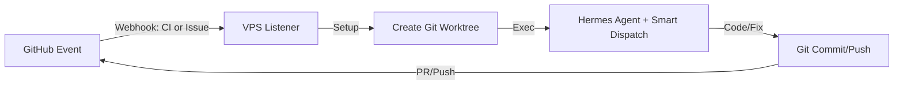

# ADR 001: Autonomous AI Developer Workflow via Git Worktrees

> [!WARNING]
> **Status: Superseded / Updated**
> The `listener.py` webhook server described in this document has been replaced by the native **Hermes cron scheduler** polling workflow. See [hermes-native-cron.md](file:///Users/thang/Development/thangvq-digital-hub/docs/architecture/hermes-native-cron.md) for details on the current dispatch orchestration. The Git worktrees and execution flow principles remain valid.

This document outlines the standard workflow for the AI Developer Workspace running on the VPS. It handles both automated CI bug fixing and feature development.

## 1. Workflow Architecture



## 2. Required Components on the VPS

1. **Base Repository (Clone):**
   The base repository is cloned once at `/home/thang/Development/thangvq-digital-hub`.
2. **Listener (Smart Dispatcher):**
   A minimal Python script listening on port 8080. It analyzes the GitHub payload (labels, event type) to dynamically determine which AI skill to use.
3. **Worktree Manager:**
   When a webhook is received, the script creates a dedicated, isolated workspace:
   ```bash
   # Create a worktree for a specific PR or Issue, isolated from the main repo
   git worktree add ../worktrees/pr-123 pr-123-branch
   ```
4. **Hermes Agent Execution:**
   Because the `.agents/skills` directory has been committed directly to the repo, the newly created worktree immediately contains all custom skills. The listener simply invokes Hermes with the dynamically selected skill based on the **Skill Routing** rules defined in `docs/PRD.md`:

   ```bash
   # Bug Fix Example: Automatically dispatched for CI failure or 'bug' label
   hermes -w ../worktrees/pr-123 -s diagnose -c "Fix the failing tests in issue #123"

   # Feature Plan Example: Automatically dispatched for 'feature' label
   hermes -w ../worktrees/feat-124 -s writing-plans -c "Break down implementation plan for issue #124"
   ```

   _(Note: The orchestrator does NOT run `npm install`. It is up to the Hermes Agent to analyze the workspace and run `npm install` or other commands autonomously if required by its skill)._

## 3. Why choose Worktree over Checkout?

- **Total Isolation:** You can have 5 failing PRs and 3 new feature requests at the same time. The listener will spawn 8 Hermes instances in 8 different worktree folders without conflicting with each other.
- **No Git conflicts:** A worktree creates a separate "view" of the repo. You don't have to worry about `git checkout` disrupting the state of another agent's ongoing work.
- **Ephemeral environments:** When the agent finishes, the listener simply runs `git worktree remove` and the environment is cleanly destroyed.
