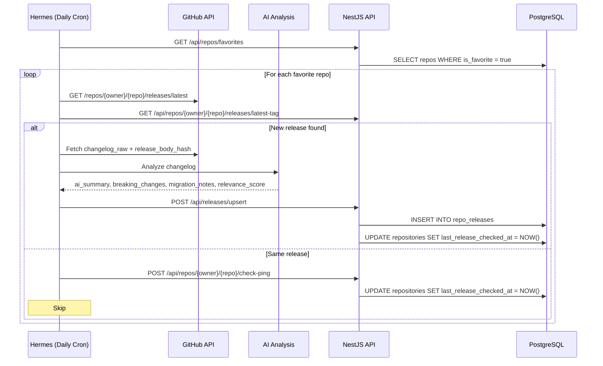

# Release Analysis Pipeline

> How Hermes monitors favorite repos for new releases and generates AI-powered summaries.

---

## Overview

Daily cronjob targets only `is_favorite = true` repos. Checks GitHub Releases API for new releases, then uses AI to analyze changelogs and persist structured summaries.

---

## Flow



---

## Data Model

### `repo_releases`

```sql
CREATE TABLE repo_releases (
    id                UUID PRIMARY KEY DEFAULT gen_random_uuid(),
    repo_full_name    TEXT NOT NULL REFERENCES repositories(full_name),
    release_tag       TEXT NOT NULL,
    release_title     TEXT,
    release_url       TEXT,
    published_at      TIMESTAMPTZ,
    changelog_raw     TEXT,
    release_body_hash TEXT,
    ai_summary        TEXT,
    breaking_changes  TEXT,
    migration_notes   TEXT,
    relevance_score   SMALLINT CHECK (relevance_score BETWEEN 0 AND 100),
    is_viewed         BOOLEAN DEFAULT FALSE,
    processed_at      TIMESTAMPTZ DEFAULT NOW(),
    UNIQUE(repo_full_name, release_tag)
);

CREATE INDEX idx_releases_repo ON repo_releases(repo_full_name);
CREATE INDEX idx_releases_unviewed ON repo_releases(is_viewed) WHERE is_viewed = FALSE;
CREATE INDEX idx_releases_published ON repo_releases(published_at DESC);
```

### New fields on `repositories`

```sql
ALTER TABLE repositories ADD COLUMN is_viewed BOOLEAN DEFAULT FALSE;
ALTER TABLE repositories ADD COLUMN viewed_at TIMESTAMPTZ;
ALTER TABLE repositories ADD COLUMN last_release_checked_at TIMESTAMPTZ;
```

---

## Relevance Scoring

Hermes assigns a `relevance_score` (0–100) based on:

| Range | Label | Criteria |
|---|---|---|
| 0–30 | Low signal | Patch fixes, minor docs updates, typo corrections |
| 31–70 | Meaningful | New features, deprecations, performance improvements |
| 71–100 | High-impact | Breaking changes, major version bumps, security fixes |

Factors considered:
- Breaking changes presence
- Semantic version jump magnitude
- Feature significance
- AI confidence level
- Repo category alignment with user interests

---

## Duplicate/Edit Detection

- `UNIQUE(repo_full_name, release_tag)` prevents duplicate inserts during retries
- `release_body_hash` (SHA-256 of changelog body) detects edited release notes
- If hash changes for same tag → trigger re-analysis

---

## Schedule

| Job | Schedule | Target |
|---|---|---|
| Favorite Release Monitor | `0 10 * * *` (daily 10AM UTC+7) | `is_favorite = true` repos only |

---

## Future: Processing Logs

Not implemented in v1, but planned:

```sql
-- repo_release_processing_logs
-- Tracks: failures, retries, token usage, model versions, latency
-- Enables: observability, cost tracking, model comparison
```
