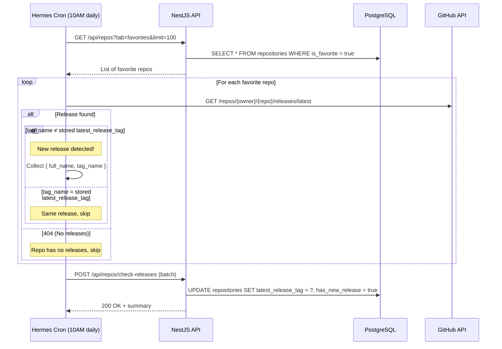

# Favorite Release Monitor

> How Hermes tracks new releases for favorite repos (lightweight, no changelog storage).
> **Updated:** 2026-05-11

---

## Overview

Daily cronjob targets only `is_favorite = true` repos. Checks GitHub Releases API for the latest release tag and compares it with the stored `latest_release_tag`. If different, sets `has_new_release = true` to highlight in the UI.

**Key simplification:** We do NOT store changelog data, AI summaries of releases, or any release history. We only track the **latest tag** and whether it's **new**.

---

## Flow



---

## Database Fields

On the `repositories` table:

```sql
latest_release_tag  TEXT,                    -- e.g. "v3.2.1"
has_new_release     BOOLEAN DEFAULT FALSE,   -- Highlighted in UI until user views changelog
```

- `latest_release_tag`: Updated by this cronjob when a new release is detected
- `has_new_release`: Set to `true` by cronjob, reset to `false` when user clicks the changelog link on the detail page

---

## Schedule

| Job | Schedule | Target |
|---|---|---|
| Favorite Release Monitor | `0 10 * * *` (daily 10AM UTC+7) | `is_favorite = true` repos only |

**Configured via:** Hermes Agent Cron Page (UI)

---

## API Endpoint

```
POST /api/repos/check-releases
Headers: x-api-key: <SYNC_API_KEY>
Body: {
  "releases": [
    { "full_name": "facebook/react", "tag_name": "v19.1.0" },
    { "full_name": "vercel/next.js", "tag_name": "v15.3.2" }
  ]
}
```

**Logic:**
1. For each entry, find repo by `full_name`
2. If `tag_name` differs from stored `latest_release_tag`:
   - Update `latest_release_tag = tag_name`
   - Set `has_new_release = true`
3. If `tag_name` is same: skip

---

## UI Behavior

- **Dashboard card:** Shows a small badge/indicator when `has_new_release = true`
- **Detail page:** Shows `latest_release_tag` + link to `https://github.com/{owner}/{repo}/releases`
- **Dismissal:** When user clicks the releases link on the detail page, frontend calls `PATCH` with `{ has_new_release: false }` to dismiss the highlight
- **No releases:** If `latest_release_tag` is null, show "No releases published" on detail page

---

## Hermes Cron Prompt Template

```
1. GET https://api.thangvq95.page/api/repos?tab=favorites&limit=100 to get all favorite repos.
2. For each repo, call GitHub API: GET https://api.github.com/repos/{full_name}/releases/latest
3. Collect results: [{ full_name, tag_name (from response) }]
   Skip any repo where GitHub returns 404 (no releases).
4. POST the results to https://api.thangvq95.page/api/repos/check-releases 
   with header x-api-key: <SYNC_API_KEY>
   Body: { "releases": [{ "full_name": "...", "tag_name": "..." }] }
```

---

## Edge Cases

| Case | Behavior |
|---|---|
| Repo has never had a release | GitHub returns 404 → skip, `latest_release_tag` stays `null` |
| Repo publishes first-ever release | `latest_release_tag` was `null` → now has value → `has_new_release = true` |
| User un-favorites a repo | Cronjob won't check it anymore (only targets `is_favorite = true`) |
| Same release tag, edited notes | No change detected (we only compare tags, not content) |
