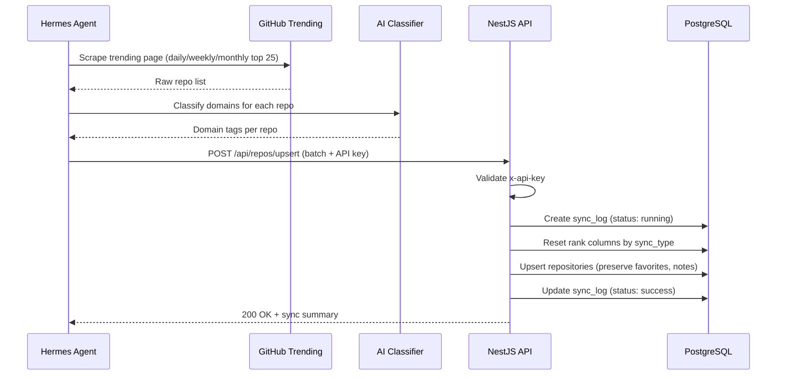

# Repository Sync Lifecycle

> How Hermes keeps the trending repository database up to date.

---

## Overview

Hermes scrapes GitHub Trending pages on a schedule, classifies repos by domain using AI, and upserts data into PostgreSQL via the NestJS API.

---

## Flow



---

## Cronjob Schedule

| Job | Schedule | Action |
|---|---|---|
| Daily Sync | `0 8,20 * * *` (8AM, 8PM UTC+7) | Scrape daily trending top 25 |
| Weekly Sync | `0 9 * * 1` (Monday 9AM) | Scrape weekly trending top 25 |
| Monthly Sync | `0 9 1 * *` (1st of month 9AM) | Scrape monthly trending top 25 |

---

## Upsert Logic

```
1. Validate x-api-key header
2. Create sync_log entry (status: "running")
3. Reset rank columns based on sync_type:
   - "daily"   → SET rank_daily = NULL
   - "weekly"  → SET rank_weekly = NULL
   - "monthly" → SET rank_monthly = NULL
   - "full"    → Reset all ranks
4. For each repo in payload:
   - UPSERT into repositories
   - On conflict (full_name): update ranks, stars, domains
   - PRESERVE: is_favorite, is_applied, is_viewed, notes, first_seen_at
5. Mark newly inserted repos as is_viewed = FALSE
6. Update sync_log (status: "success", counts)
7. Return summary response
```

---

## Data Preserved on Upsert

These fields are **never overwritten** by sync:

| Field | Reason |
|---|---|
| `is_favorite` | User preference |
| `is_applied` | User preference |
| `is_viewed` | User interaction state |
| `viewed_at` | User interaction timestamp |
| `notes` | User-written content |
| `first_seen_at` | Historical tracking |

---

## Sync Audit Trail

```sql
CREATE TABLE sync_logs (
    id              UUID PRIMARY KEY DEFAULT gen_random_uuid(),
    sync_type       TEXT NOT NULL,       -- "daily", "weekly", "monthly", "full"
    repos_scraped   INTEGER DEFAULT 0,
    repos_new       INTEGER DEFAULT 0,
    repos_classified INTEGER DEFAULT 0,
    status          TEXT DEFAULT 'running', -- "running", "success", "failed"
    error_message   TEXT,
    started_at      TIMESTAMPTZ DEFAULT NOW(),
    completed_at    TIMESTAMPTZ
);
```
