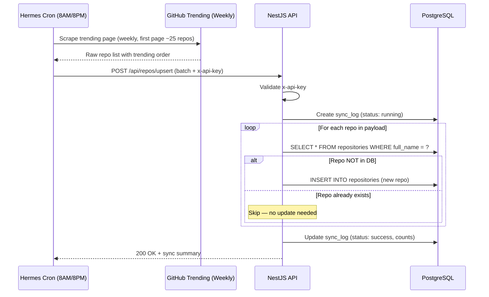

# Repository Sync Lifecycle

> How Hermes keeps the trending repository database up to date.
> **Updated:** 2026-05-11 (Simplified from multi-period to weekly-only)

---

## Overview

Hermes scrapes the first page of GitHub Weekly Trending on a schedule (2x daily) and upserts new repos into PostgreSQL via the NestJS API. Repos that already exist are skipped entirely — no re-ranking, no overwriting.

Users can also manually add a repository via the `POST /api/repos/add` endpoint (from the Dashboard UI). This fetches the repo directly from GitHub and inserts it into the database with `is_read = true`.

---

## Flow



---

## Cronjob Schedule

| Job | Schedule | Action |
|---|---|---|
| Weekly Trending Sync | `0 8,20 * * *` (8AM & 8PM UTC+7) | Scrape first page of `github.com/trending?since=weekly` |
| Favorite Release Monitor | `0 10 * * *` (10AM UTC+7) | Check favorite repos for new releases → [release-analysis-pipeline.md](release-analysis-pipeline.md) |

**Configured via:** Hermes Agent Cron Page (UI)

---

## Upsert Logic

```
1. Validate x-api-key header
2. Create sync_log entry (status: "running")
3. For each repo in payload:
   - Check: does full_name exist in repositories table?
   - If NOT exists → INSERT new row (is_favorite=false, is_archived=false, has_new_release=false, is_read=false, latest_release_tag=null)
   - If EXISTS → Skip entirely (preserve all user data)
4. Update sync_log (status: "success", repos_scraped, repos_new)
5. Return summary response
```

**Key difference from old design:** No rank reset, no column overwriting, no re-classification. Pure append-only for new repos.

---

## Data Preserved (Always)

Since existing repos are never overwritten, ALL user fields are inherently preserved:

| Field | Reason |
|---|---|
| `is_favorite` | User preference |
| `is_archived` | User preference |
| `is_read` | User view tracking |
| `latest_release_tag` | Release tracking state |
| `has_new_release` | Release notification state |
| `ai_summary` | AI-generated content (Markdown, from Magic Analyze) |
| `first_seen_at` | Historical tracking |

---

## Sync Audit Trail

```sql
CREATE TABLE sync_logs (
    id              UUID PRIMARY KEY DEFAULT gen_random_uuid(),
    repos_scraped   INTEGER DEFAULT 0,
    repos_new       INTEGER DEFAULT 0,
    status          TEXT DEFAULT 'running', -- "running", "success", "failed"
    error_message   TEXT,
    started_at      TIMESTAMPTZ DEFAULT NOW(),
    completed_at    TIMESTAMPTZ
);
```

---

## Hermes Cron Prompt Template

```
Scrape the first page of https://github.com/trending?since=weekly.
For each repository, extract: full_name (owner/repo), description, html_url, 
language, avatar_url, stars_total, stars_growth (e.g. "1,234 stars this week"), 
forks_total, and trending_rank (1-based position on the page).
POST the results to https://api.thangvq95.page/api/repos/upsert 
with header x-api-key: <SYNC_API_KEY>.
Body format: { "repositories": [{ full_name, description, html_url, ... }] }
```
