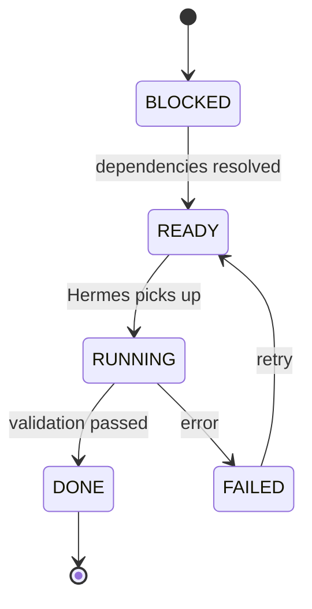

# Task Execution Model — Phase + DAG

> Defines how Hermes Agent orchestrates multi-task work.

---

## Overview

Tasks are organized in two layers:

1. **Phases** — human-readable groupings, executed sequentially
2. **Dependency DAG** — explicit `depends_on` graph within each phase, enabling parallel execution

```
Phase
 └── Tasks
      └── depends_on graph (DAG)
```

---

## Task State Machine

```
READY    → all dependencies completed, waiting for execution
BLOCKED  → waiting on unfinished dependencies
RUNNING  → Hermes currently executing
FAILED   → execution failed, requires retry/self-heal
DONE     → validated + tests passed
```

State transitions:



---

## Task Metadata Schema

Every task declares:

```yaml
id: string                    # unique task identifier
phase: number                 # phase grouping (1, 2, 3...)
depends_on: string[]          # task IDs that must complete first
inputs: string[]              # files/resources this task reads
outputs: string[]             # files/resources this task produces
context_requirements: string[] # GitNexus context paths for focused retrieval
validation: string            # how to verify completion (e.g., "playwright test passes")
rollback: string              # how to undo if needed
estimated_scope: string       # "small" | "medium" | "large"
retry_policy:
  max_retries: 3
  backoff: "exponential"
```

---

## Example: Dashboard Feature

```yaml
# Phase 1 — Foundation
tasks:
  - id: db-schema
    phase: 1
    inputs: [docs/architecture/release-analysis-pipeline.md]
    outputs: [backend/migrations/repo-releases.sql]
    validation: "migration runs without errors"

  - id: repo-entity
    phase: 1
    depends_on: [db-schema]
    outputs: [backend/src/repos/entities/repo-release.entity.ts]

# Phase 2 — Backend API
tasks:
  - id: repo-service
    phase: 2
    depends_on: [repo-entity]
    context_requirements: [backend/src/repos/*]

  - id: repo-controller
    phase: 2
    depends_on: [repo-service]

  - id: repo-e2e-tests
    phase: 2
    depends_on: [repo-controller]
    validation: "playwright API tests pass"

# Phase 3 — Frontend UI
tasks:
  - id: release-feed-page
    phase: 3
    depends_on: [repo-controller]
    context_requirements: [components/dashboard/*, app/tech/*]
```

---

## GitHub Projects Sync

Hermes keeps GitHub Projects in sync with task state:

| Task State | GitHub Project Column |
|---|---|
| BLOCKED | Backlog |
| READY | To Do |
| RUNNING | In Progress |
| FAILED | In Progress (labeled `failed`) |
| DONE | Done |

---

## Execution Rules

1. Hermes completes all tasks in Phase N before starting Phase N+1
2. Within a phase, tasks with no unresolved `depends_on` execute in parallel
3. A failed task blocks its dependents but not its siblings
4. After `max_retries` exhausted, task stays FAILED and Hermes flags for human review
5. Every DONE task must have its `validation` criteria met
